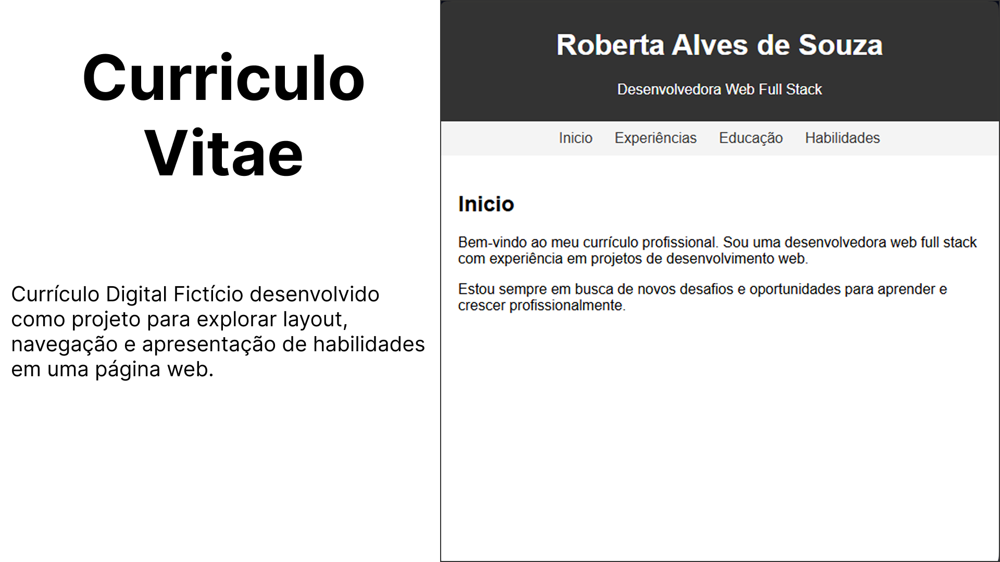

# 📝 Projeto de Currículo Digital Fictício

Este é um **projeto de currículo digital fictício** 🎨, desenvolvido como parte do curso **“JavaScript do Básico ao Avançado + 132 Projetos Reais”** do **Clevison Santos** 💻.  

O objetivo foi criar um portfólio web interativo que organiza informações de forma clara, incluindo:  

- 🧑‍💼 Experiências  
- 🎓 Educação  
- 🛠️ Habilidades  

🌐 **Veja o projeto online no GitHub Pages:**  
[Link para o GitHub Pages](https://thamiressarges.github.io/curriculum-vitae)  

Este projeto é um ótimo exemplo de como aplicar **JavaScript**, manipulação do **DOM** e criação de **interfaces interativas** ⚡.
